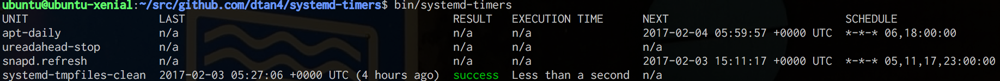

# systemd-timers

[](https://travis-ci.org/dtan4/systemd-timers)

Better `systemctl list-timers`



## VS. `systemctl list-timers`

systemd has `systemctl list-timers` command to list installed systemd timers.

```bash
core@ip-10-1-2-255 ~ $ sudo systemctl list-timers
NEXT                         LEFT         LAST                         PASSED       UNIT                           ACTIVATES
Fri 2017-02-03 13:54:00 JST  12s left     Fri 2017-02-03 13:53:02 JST  44s ago      failed.timer                   failed.service
Fri 2017-02-03 19:03:00 JST  5h 9min left Fri 2017-02-03 05:03:18 JST  8h ago       docker-cleanup.timer           docker-cleanup.service
Fri 2017-02-03 21:51:07 JST  7h left      Thu 2017-02-02 21:51:07 JST  16h ago      systemd-tmpfiles-clean.timer   systemd-tmpfiles-clean.service
```

We cannot check task execution result (whether last execution succeeded or failed) at this view.
We have to do `systemctl status <unit>` for each task.
It's so bothersome (at least for me).

This `systemd-timers` show task execution result at once. They are colorized; success is green, failed is red.

```bash
core@ip-10-1-2-255 ~ $ systemd-timers
UNIT                      LAST                                          RESULT   EXECUTION TIME          NEXT                           SCHEDULE
update-valec              2017-02-03 03:00:17 +0900 JST (15 hours ago)  success  7 seconds               2017-02-04 03:00:00 +0900 JST  *-*-* 03:00:00
backup-prod               2017-02-03 06:10:17 +0900 JST (12 hours ago)  failed   Less than a second      2017-02-04 06:10:00 +0900 JST  *-*-* 06:10:00
backup-stag               2017-02-03 06:05:08 +0900 JST (12 hours ago)  failed   Less than a second      2017-02-04 06:05:00 +0900 JST  *-*-* 06:05:00
```
